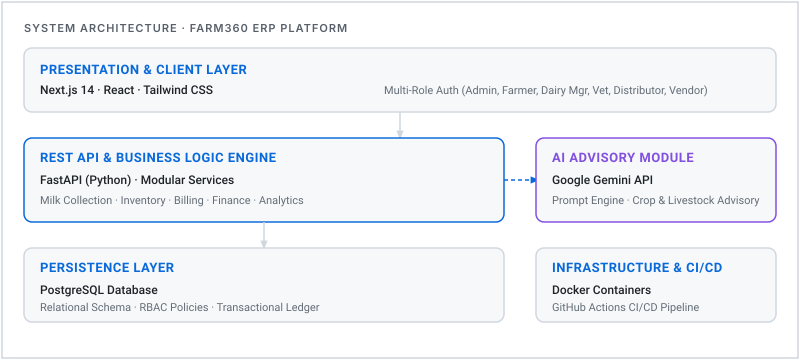

# Jaideep Shetti
**Cloud & DevOps Engineer shipping AI-integrated agricultural systems**

 

 

---

## ⚡ Engineering Dashboard

| Metric / Dimension | Status / Details |
|---|---|
| 🚀 **Current Flagship** | **Farm360 ERP** — Cloud-native AI agriculture platform |
| 📍 **Location** | Bengaluru, India |
| 🎓 **Education** | B.Tech, Information Technology · Alliance University (Specialization: Cloud & DevOps) |
| 🛠️ **Active Focus** | Advanced Kubernetes (Helm, Operators), Infrastructure as Code (Terraform), GitHub Actions CI/CD |
| 🌱 **Now Learning** | MLOps pipelines, Platform Engineering, Cloud Native Observability |
| 🎯 **Target Roles** | Cloud Engineering & DevOps Roles |

---

## 📖 About

I am a Cloud & DevOps Engineer specializing in designing automated, scalable cloud infrastructure and building full-stack applications with integrated AI capabilities.

My core work centers on **Farm360**, a cloud-native agricultural ERP designed to digitize dairy and farm operations—from multi-role access control and automated inventory tracking to LLM-powered agricultural advisory.

> *"Automate everything that can be automated, and design infrastructure so the next engineer can read it like documentation."*

---

## 🏗️ Flagship System: Farm360 ERP

> **AI-powered cloud platform for agricultural & dairy operations**

Farm360 is a cloud-native platform designed to digitize complex agricultural supply chains, milk collection, inventory management, billing, veterinary workflows, and financial analytics into a unified operational engine.

### System Architecture

<picture>
  <source media="(prefers-color-scheme: dark)" srcset="assets/farm360-architecture-dark.svg">
  
</picture>

 

### Technical Highlights
- **Multi-Role Security:** Granular Role-Based Access Control (RBAC) supporting Admin, Farmer, Dairy Manager, Veterinarian, Distributor, and Vendor.
- **Modular API Gateway:** Built with FastAPI (Python) enforcing clean separation between billing, inventory, and analytics services.
- **Embedded AI Advisor:** Integrated with Google Gemini API to deliver contextual farming guidance and disease mitigation recommendations.
- **Containerized Infrastructure:** Designed for containerized deployments with automated GitHub Actions CI/CD workflows.

**Stack:** Next.js · React · Tailwind CSS · FastAPI · Python · PostgreSQL · Docker

[🌐 Live Application Demo](https://dairyfarm.base44.app/)

---

## 🛠️ Technical Capabilities

### Cloud & Infrastructure
- **Cloud Providers:** AWS, Azure, Google Cloud Platform (GCP)
- **Infrastructure as Code:** Terraform (module design, state management)
- **Containers & Orchestration:** Docker, Kubernetes, Helm

### DevOps & Automation
- **CI/CD Pipelines:** GitHub Actions, Jenkins
- **OS & Scripting:** Linux Administration, Bash, Python scripting
- **Version Control:** Git, GitHub Flow

### Backend & Databases
- **Backend Frameworks:** FastAPI, Python, Java
- **Databases:** PostgreSQL, MySQL, Oracle DB
- **AI & Integrations:** Google Gemini API, Prompt Engineering

---

## 📜 Certifications & Validations

### Completed
- **OCI DevOps Professional** — Oracle Cloud Infrastructure
- **Microsoft Azure AZ-900** — Azure Fundamentals
- **Java Foundations** — Oracle Certified Associate

### Target Certifications (Roadmap)
- **Certified Kubernetes Administrator (CKA)** — Cloud Native Computing Foundation
- **AWS Certified Solutions Architect – Associate (SAA)** — Amazon Web Services
- **Google Cloud Professional Cloud Architect** — Google Cloud

---

## 🐍 Activity & Contribution Metrics

<picture>
  <source media="(prefers-color-scheme: dark)" srcset="https://raw.githubusercontent.com/jaideepshetti05/jaideepshetti05/output/github-contribution-grid-snake-dark.svg">
  
</picture>

 

---

## 🗺️ Engineering Progression

| Stage | Domain | Status | Key Deliverables |
|---|---|---|---|
| **Phase 1** | Foundation & Languages | ✅ Complete | Java, Python, Data Structures & Algorithms |
| **Phase 2** | Cloud & DevOps Core | ✅ Active | OCI DevOps Pro, Azure AZ-900, Docker, Linux |
| **Phase 3** | Flagship Delivery | 🚀 Shipped | Farm360 ERP & Gemini AI Advisor |
| **Phase 4** | Advanced Orchestration | 🛠️ In Progress | Terraform module architecture, Helm, Kubernetes |
| **Phase 5** | MLOps & Platform Eng | 🎯 Upcoming | ML deployment pipelines, Cloud-native observability |

---

## 📂 Other Projects

<b>View Additional Projects</b>

 

### Voice-Controlled Wheelchair
**IoT Accessibility Prototype**  
Smart wheelchair prototype allowing individuals with mobility impairments to direct movement via voice commands over Bluetooth.  
`Arduino` · `Embedded C` · `Bluetooth` · `Android`

### Core Banking Management System
**Transaction & Workflow Simulation**  
Simulated core banking backend managing accounts, transaction logs, and ledger integrity.  
`Java` · `SQL` · `OOP`

### Student Management System
**Administrative Records Engine**  
Workflow tool managing academic data, student enrollments, and administrative reporting.  
`Python` · `SQL`

---

## 📬 Contact & Connect

 

*"Automate everything that can be automated — build what matters most."*

